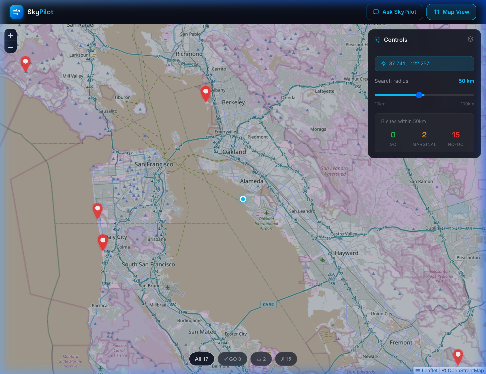
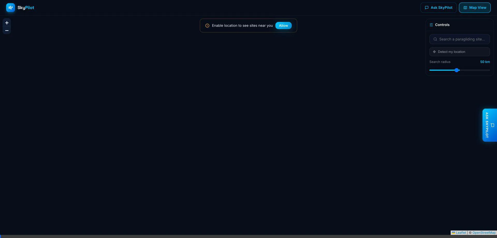
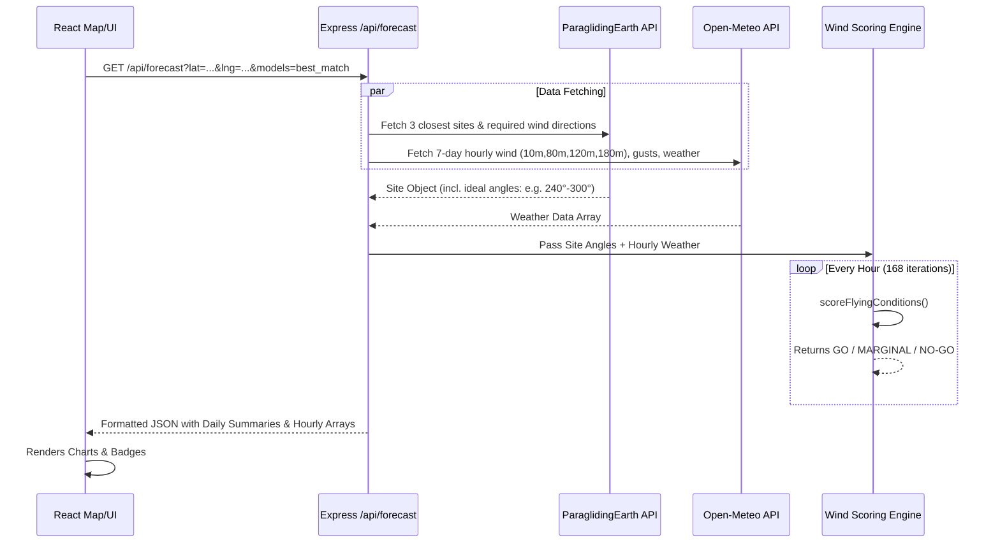
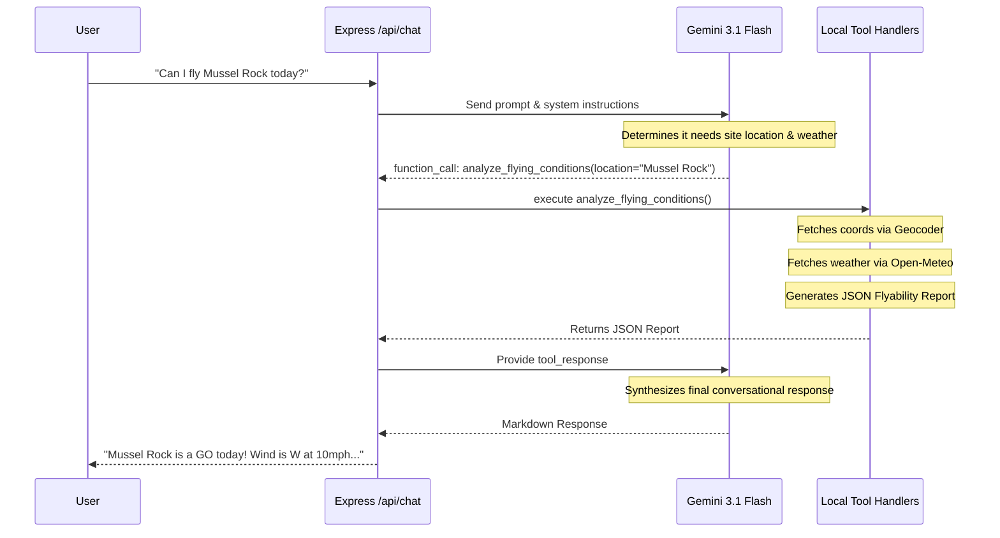

# 🪂 SkyPilot — AI Paragliding Assistant

SkyPilot is a full-stack AI-powered paragliding conditions advisor. It helps pilots evaluate if conditions are safe to fly at paragliding sites near them. By combining real-time multi-altitude weather data from Open-Meteo, site characteristics from ParaglidingEarth, and the reasoning capabilities of Gemini 3.1 Flash, SkyPilot provides clear **GO / MARGINAL / NO-GO** assessments, interactive maps, and conversational advice.

## 📸 Screenshots & Walkthrough

| Map View & Controls | Forecast & Model Selection |
|----------|----------------------------|
|  |  |
| **Site Lookup & Detailed Forecast** | **Conversational Agent** |
|  |  |

---

## 🚀 Features

- **Interactive Map:** View nearby paragliding sites with color-coded markers based on current flyability.
- **Hourly & 7-Day Forecasts:** detailed breakdowns of wind by altitude (10m, 80m, 120m, 180m), wind direction, gusts, and weather conditions.
- **Model Selection:** Choose your preferred weather model: Auto (HRRR for North America + GFS/ECMWF globally), GFS, ECMWF, or ICON.
- **Site-Specific AI Chat:** Start a conversation with SkyPilot about a specific site. Ask questions like "Can I fly Mussel Rock today?" or "When is the best window this week?"
- **Search:** Find any site using the Nominatim geocoding API combined with ParaglidingEarth data.

---

## 🛠️ Developer Setup

This project uses a monorepo structure with a **React (Vite)** frontend and a **Node.js (Express)** backend.

### Prerequisites
- Node.js (v18+)
- A [Google Gemini API Key](https://aistudio.google.com/)

### 1. Clone & Set up Environment
Clone the repository and create an `.env` file in the **root** folder of the project:

```bash
# In the root folder: Paragliding-agent/
touch .env
```

Add your API keys to the `.env` file:
```env
GEMINI_API_KEY=your_gemini_api_key_here
PORT=3001

# Optional: For future vector database integrations
PINECONE_API_KEY=
PINECONE_INDEX=
```

### 2. Install Dependencies

Install dependencies for both the `client` and `server` folders.

```bash
# Terminal 1: Install Server Dependencies
cd server
npm install

# Terminal 2: Install Client Dependencies
cd client
npm install
```

### 3. Run the Development Servers

You will need to run both the frontend and backend servers simultaneously. The frontend handles proxies automatically via Vite to the backend on port `3001`.

```bash
# Terminal 1: Start the Backend (from project root)
cd server
npm run dev

# Terminal 2: Start the Frontend (from project root)
cd client
npm run dev
```

- **Frontend Application:** `http://localhost:5173`
- **Backend API:** `http://localhost:3001`

---

## 🏗️ Detailed Engineering & Architecture

SkyPilot leverages a tool-calling architecture. The Node.js Express server hosts a LangChain-style function-calling loop wrapped around Google's `@google/generative-ai` SDK. 

When a user asks the AI a question, or requests a forecast, the backend dynamically fetches and synthesizes data from multiple REST APIs.

### 1. Forecast & Flyability Pipeline
The backend calculates flyable windows based on site requirements (e.g. Mussel Rock requires W or NW winds) against incoming hourly weather data.



### 2. SkyPilot Conversational Agent Flow
The Chat route uses an agentic loop. Gemini can call `get_paragliding_sites`, `get_weather_forecast`, or `analyze_flying_conditions`.



### Key Technical Decisions
- **`node-cache`**: API responses from Paragliding Earth are cached for 1 hour, and Open-Meteo for 10 minutes, significantly reducing external API round-trips and speeding up Map rendering.
- **Vite Proxy**: Circumvents CORS issues during development by proxying `/api` from `5173` to `3001`.
- **CSS Modules vs Tailwind**: Vanilla CSS / Inline styles were chosen for this specific project to keep the dependency footprint small while maintaining maximum control over modern glassmorphism aesthetics.
- **Fail-Safe Processing**: A single site's failure to load from ParaglidingEarth will not crash the entire `/api/sites` endpoint; `try-catch` blocks ensure partial arrays are returned gracefully. Rate limits on the Gemini API are caught and returned as clean 500 error JSONs to the client.

## 📜 API Documentation 

- `GET /api/sites?lat=X&lng=Y&distance=50` - Get all sites within a radius, enriched with current weather and a GO/MARGINAL/NO-GO rating.
- `GET /api/forecast?lat=X&lng=Y&models=best_match` - Returns a 7-day extended forecast with hourly wind arrays and a daily summary block.
- `GET /api/search?q=Mussel+Rock` - Geocodes a text string and returns the closest matched paragliding sites.
- `POST /api/chat` - Conversational endpoint accepting `{ message: "...", history: [...] }`.
