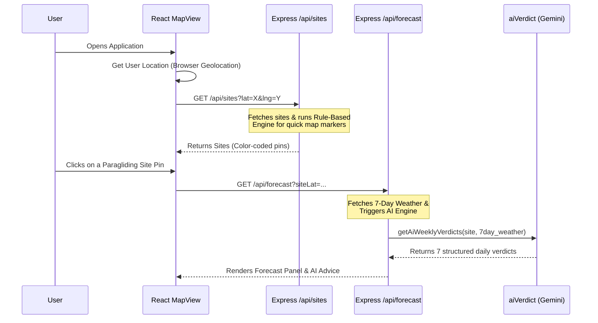
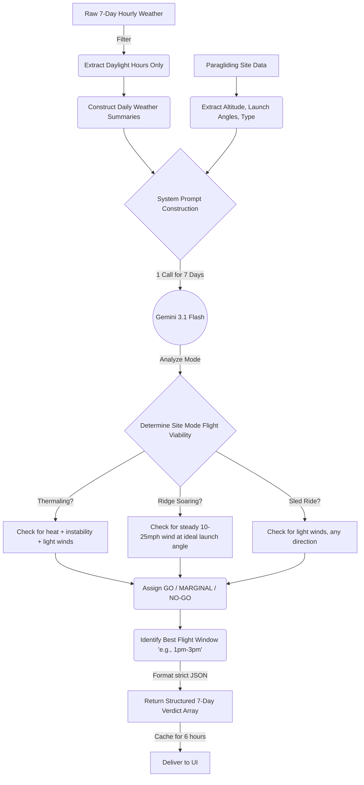
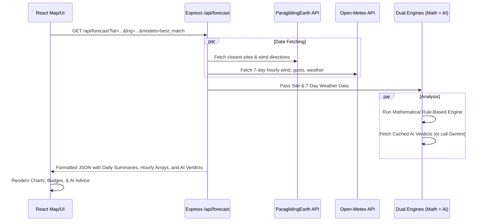

# 🪂 SkyPilot — AI Paragliding Assistant

SkyPilot is a full-stack AI-powered paragliding conditions advisor. It helps pilots evaluate if conditions are safe to fly at paragliding sites near them. By combining real-time multi-altitude weather data from Open-Meteo, site characteristics from ParaglidingEarth, and the reasoning capabilities of Gemini 3.1 Flash, SkyPilot provides clear **GO / MARGINAL / NO-GO** assessments, interactive maps, and conversational advice.

## 📸 Screenshots & Walkthrough

| Map View & Controls | Forecast & Model Selection |
|----------|----------------------------|
|  |  |
| **Site Lookup & Detailed Forecast** | **Conversational Agent** |
|  |  |

---

## 🚀 Features

- **Interactive Map:** View nearby paragliding sites with color-coded markers based on current flyability.
- **Hourly & 7-Day Forecasts:** detailed breakdowns of wind by altitude (33ft, 262ft, 394ft, 591ft), wind direction, gusts, and weather conditions.
- **Model Selection:** Choose your preferred weather model: Auto (HRRR for North America + GFS/ECMWF globally), GFS, ECMWF, or ICON.
- **Site-Specific AI Chat:** Start a conversation with SkyPilot about a specific site. Ask questions like "Can I fly Mussel Rock today?" or "When is the best window this week?"
- **Search:** Find any site using the Nominatim geocoding API combined with ParaglidingEarth data.

---

## 🛠️ Developer Setup

This project uses a monorepo structure with a **React (Vite)** frontend and a **Node.js (Express)** backend.

### Prerequisites
- Node.js (v18+)
- A [Google Gemini API Key](https://aistudio.google.com/)

### 1. Clone & Set up Environment
Clone the repository and create an `.env` file in the **root** folder of the project:

```bash
# In the root folder: Paragliding-agent/
touch .env
```

Add your API keys to the `.env` file:
```env
GEMINI_API_KEY=your_gemini_api_key_here
PORT=3001

# Optional: For future vector database integrations
PINECONE_API_KEY=
PINECONE_INDEX=
```

### 2. Install Dependencies

Install dependencies for both the `client` and `server` folders.

```bash
# Terminal 1: Install Server Dependencies
cd server
npm install

# Terminal 2: Install Client Dependencies
cd client
npm install
```

### 3. Run the Development Servers

You will need to run both the frontend and backend servers simultaneously. The frontend handles proxies automatically via Vite to the backend on port `3001`.

```bash
# Terminal 1: Start the Backend (from project root)
cd server
npm run dev

# Terminal 2: Start the Frontend (from project root)
cd client
npm run dev
```

- **Frontend Application:** `http://localhost:5173`
- **Backend API:** `http://localhost:3001`

---

## 🏗️ Detailed Engineering & Architecture

SkyPilot leverages a tool-calling architecture in a Node.js Express server, hosting a LangChain-style function-calling loop wrapped around Google's `@google/generative-ai` SDK. When a user interacts with the app, the backend dynamically fetches and synthesizes data from multiple REST APIs.

### Key Architectural Decisions
- **Unified Rule Engines:** Flyability is determined by a dual-engine approach combining deterministic algorithms (Rule-Based Engine) and semantic LLM synthesis (AI-Based Engine). The AI-Based Engine acts as the supreme authority when available.
- **Optimized Gemini Calls:** The AI weekly verdict analyzes all 7 days in a single Gemini API call to reduce latency and token usage.
- **Caching Mechanism:** `node-cache` is heavily utilized to avoid redundant API calls. ParaglidingEarth API responses are cached for 1 hour, Open-Meteo for 10 minutes, and multi-day Gemini verdicts for 6 hours.
- **Vite Proxy:** Circumvents CORS issues during development by proxying API calls from port `5173` to `3001`.
- **Fail-Safe Processing:** If a specific site fails to load or an API rate limit is reached, `try-catch` blocks ensure partial arrays are returned gracefully rather than crashing endpoints.

---

## 🧠 Dual Rule Engines for Flyability

SkyPilot uses two cooperating engines to determine whether a site is **GO**, **MARGINAL**, or **NO-GO**. 

### 1. Rule-Based Engine (Deterministic Validation)
Located in `utils/windUtils.js` and `tools/analyzeFlyingConditions.js`, this engine computes a safe baseline using hard math:
- **Wind Speed & Gusts:** Checks 10m wind speeds against physical limits (e.g., > 18mph is generally a NO-GO, > 14mph is MARGINAL depending on site type).
- **Wind Direction Matching:** Checks if the current or forecasted wind direction (in degrees) falls within the site's acceptable launch angles from ParaglidingEarth. It scores the direction on a scale (0 to 1).
- **Environmental Factors:** Checks precipitation, visibility, and cloud cover to deduct points or outright flag a NO-GO.
- **Output:** Returns a quantitative summary composed of `rating`, `issues`, and `positives`.

### 2. AI-Based Rule Engine (Semantic & Contextual Analysis)
Located in `services/aiVerdict.js`, this engine utilizes Gemini 3.1 Flash to add nuanced reasoning that raw math misses. It evaluates the holistic picture of the atmosphere and site topology rather than just threshold limits.

- **Comprehensive Context:** It consumes the raw 7-day hourly weather data alongside site metadata (altitude, site types, acceptable wind directions).
- **Daily Syntheses:** For each day, the AI generates a qualitative assessment, providing a conversational `headline`, a detailed `reasoning` paragraph, and identifying the `bestWindow` of time for a flight.
- **Overrides:** The AI's verdict rating (GO/MARGINAL/NO-GO) supersedes the Rule-Based rating in the UI, ensuring that complex atmospheric subtleties are accounted for.

#### AI Thought Process & Application Flow

To understand the AI Rule Engine, it is helpful to trace the data flow from the moment the user opens the application to the moment the AI returns a verdict.

**1. Application Load & Initial Data Fetch**

When the user lands on the application, the system quickly fetches the required data using the lightweight Rule-Based engine to populate the map before triggering the heavier AI engine dynamically on-demand.



**2. Inside the AI Rule Engine's "Brain"**

Once `aiVerdict.js` is invoked, it aggregates thousands of raw data points into a condensed format, structures a strict system prompt, and asks Gemini to perform expert-level semantic evaluation.



---

## 📜 API Documentation

### Weather & Site APIs
- **`GET /api/sites`**
  - **Query Params:** `lat`, `lng`, `distance`
  - **Description:** Returns all paragliding sites within the specified radius, enriched with current weather and rule-based GO/MARGINAL/NO-GO ratings.
  
- **`GET /api/forecast`**
  - **Query Params:** `lat`, `lng`, `siteLat` (optional), `siteLng` (optional), `models` (e.g., `best_match`)
  - **Description:** Returns a 7-day extended forecast with hourly wind arrays, a daily summary block, and full AI verdicts mapped by date.

### Search API
- **`GET /api/search`**
  - **Query Params:** `q` (query string, e.g., "Mussel Rock"), `limit`
  - **Description:** Uses Nominatim geocoding to find raw coordinates, then performs a radial search in ParaglidingEarth. Additionally, performs fuzzy name-matching in a broader radius to ensure high-accuracy search results.

### Conversational API
- **`POST /api/chat`**
  - **Request Body:** `{ message: "...", history: [{role: "user"|"model", content: "..."}], location: {lat, lng} }`
  - **Description:** Agentic loop endpoint. Gemini can dynamically invoke local tools such as `analyze_flying_conditions` (which fetches weather and evaluates flyability) or `get_paragliding_sites` before returning a synthesized Markdown response to the user.

---


